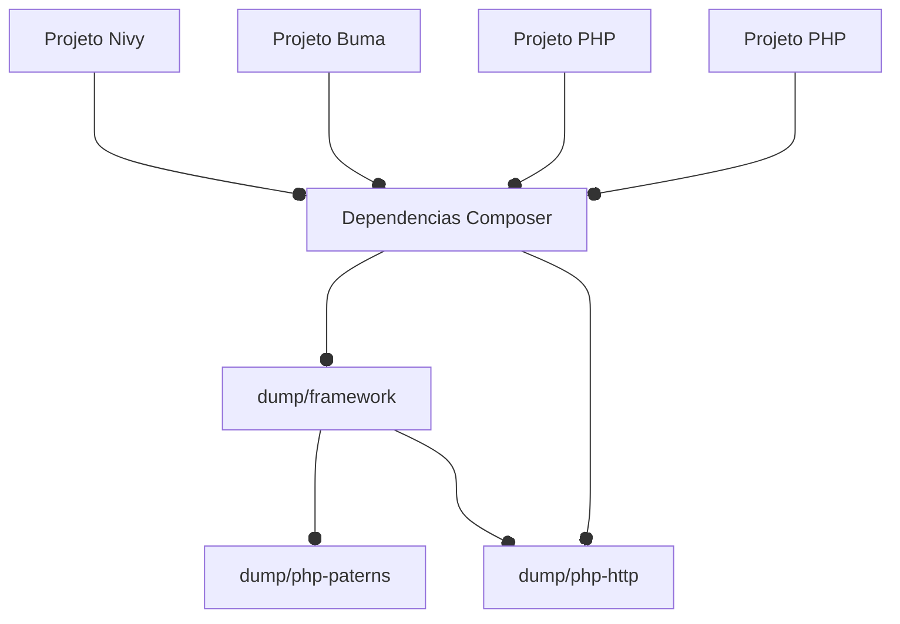

### The Dump PHP Framework.

> Coleção de pacotes em comum para uso nas aplicações PHP. 

Este repositório usa o conceito de `git submodule` com sincronização automatica. Você pode ler mais em [Repositórios dentro de um repositório com sincronização automática](https://github.com/dumptecnologia/.github/wiki/%F0%9F%93%95-Tutoriais#reposit%C3%B3rios-dentro-de-um-reposit%C3%B3rio-com-sincroniza%C3%A7%C3%A3o-autom%C3%A1tica).

debit

 - Fazer com que o continuous-delivery.yml use uma lista de pacotes ao inves de duplicar o codigo



[//]: # (```mermaid)

[//]: # (flowchart TB)

[//]: # (    a[Dependencias Composer] <--o H)

[//]: # (    b[Dependencias Composer] <--o H)

[//]: # (    c[Dependencias Composer] <--o H)

[//]: # (    d[Dependencias Composer] <--o H)

[//]: # (    e[Dependencias Composer])

[//]: # (    H <--o N)

[//]: # (    H <--o M)

[//]: # (    d <--o M)

[//]: # (    n[Dependencias Composer])

[//]: # (    m[Dependencias Composer])

[//]: # (    )
[//]: # (    subgraph A[Projeto Nivy])

[//]: # (    a)

[//]: # (    end)

[//]: # (    subgraph B[Projeto Buma])

[//]: # (    b)

[//]: # (    end)

[//]: # (    subgraph C[Projeto PHP])

[//]: # (    c)

[//]: # (    end)

[//]: # (    subgraph D[Projeto PHP])

[//]: # (    d)

[//]: # (    end)

[//]: # (    subgraph H[dump/framework])

[//]: # (    e)

[//]: # (    end)

[//]: # (    subgraph N[dump/php-paterns])

[//]: # (    m)

[//]: # (    end)

[//]: # (    subgraph M[dump/php-http])

[//]: # (    n)

[//]: # (    end)

[//]: # (```)